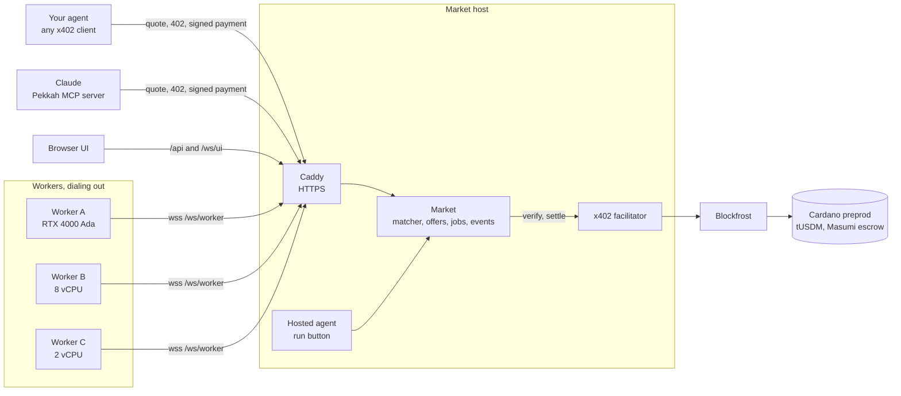

# Pekkah

Pekkah is a market where idle machines sell compute per job to AI agents. My agent asks for a job with a deadline and a budget, the market matches it to a worker it has measured, and the agent pays per job with x402 on Cardano preprod, in test tUSDM, with no account. The payment settles only after the job delivers: when a job fails, the market never broadcasts the payment, so it costs nothing. (That relies on an honest market; see the honest limits.)

**Live:** https://146-190-188-100.sslip.io (Cardano preprod, test tokens only)

Three things came on top of the basic market:
- **Escrow, end to end.** Through Masumi's escrow, the payment is locked after the job delivers. The market then records the result's hash in the escrow as worker A, and after the unlock time releases it: the price to worker A, the collateral back to the buyer. No human step. A lock whose result never comes goes back to the buyer.
- **Claude shops for compute.** With the Pekkah MCP server, Claude looks at the market, gets free quotes, keeps to the budget I gave and asks me before it pays more.
- **Any machine can join.** One command installs the worker on a Linux machine with Docker. It joins on probation: listed and measured, but it sells nothing until I add it to the allowlist.

I built it solo during the TOKEN2049 Origins Hackathon (6 to 7 October 2026). The write-up is in [docs/WRITEUP.md](docs/WRITEUP.md).

## What you can watch

Three real workers are online, each with a measured speed and its own prices:

| Worker | Machine | Sells |
| --- | --- | --- |
| A | RTX 4000 Ada, 20 GB VRAM | images (GPU) and CPU renders |
| B | 8 vCPU | CPU renders |
| C | 2 vCPU | CPU renders |

The run button starts my agent on one of these scenarios:

- **gpu-image**: an image on a GPU with at least 16 GB, at most $0.05, within 60 s. Only A fits.
- **cpu-counter**: an HD render for at most $0.015. Nothing fits, so the market answers with the market price ($0.03) and the next best offer (C at $0.02). My agent's private ceiling allows it, so it accepts.
- **cpu-tight**: a heavy render within 20 s, at most $0.03. A is over budget, C is too slow by its measured speed, so B wins.
- **failover**: my agent buys C and I kill the job mid-run. Nothing is charged, and the agent re-quotes without C and pays B.
- **gpu-image-escrow**: the payment is locked in Masumi's escrow on preprod after the job delivers, with worker A as the seller. The market records the result's hash in the escrow as worker A. About 31 minutes after the 402, the market releases the escrow: the price to worker A, the collateral back to the buyer.

The page follows a run live: every step appears as the backend emits it, in order, and the current step stays in view until you scroll. `?run=<runId>` reopens any recent run, for example to watch an escrow's release after its unlock time. Machines on probation are listed under "Joining the network", with the id the market gave them.

## Architecture



- `apps/market`: quotes, offers, the paid routes, the worker registry, the event log and the UI's WebSocket. It also submits escrow results and releases escrows after their unlock, as Seller A.
- `apps/facilitator`: the x402 facilitator for `cardano:preprod`. It verifies signed payments and broadcasts them through Blockfrost.
- `apps/agent`: my agent. It runs as a CLI or as the hosted service behind the run button.
- `apps/mcp`: the MCP server Claude uses to shop, with the same x402 buyer as my agent ([apps/mcp/README.md](apps/mcp/README.md)).
- `apps/worker`: runs on each machine. It measures the hardware, dials out to the market and runs jobs in sandboxed containers.
- `packages/matcher`: the pure matching function. `packages/protocol`: every schema, shared by all apps.
- `workloads/fractal`: a deterministic CPU render in integer arithmetic, so the same job gives the same bytes on every CPU. `workloads/flux`: the GPU image server on worker A.

Workers need no inbound port: they dial out to the market. Each CPU job runs in a fresh container with no network, a read-only file system, no capabilities, a non-root user, and memory, CPU and process limits. Image jobs go to one warm FLUX container on worker A, which only the worker can reach, over an internal Docker network.

## How a payment works

1. **Quote.** My agent sends a compute request: the workload, a deadline and a budget. The market answers with offers from the workers it has measured, or with the market price and a counter-offer when nothing fits, plus a reason for every worker it rejected.
2. **Decide.** The agent accepts an offer within its private ceiling, or declines. No human step.
3. **402.** The agent asks for the job. The market answers `402 Payment Required`: pay this worker's address this price, in tUSDM.
4. **Sign.** The agent checks that the 402 asks for exactly the offer it accepted and that its spend caps allow it. It then signs a Cardano transaction and sends it with the request.
5. **Run.** The facilitator verifies the signed transaction. The market dispatches the job to that worker and waits for the result.
6. **Settle.** Only after the result arrives does the facilitator broadcast the transaction and wait for it on chain. The agent gets the result and a receipt with a Cardanoscan link. If the job fails, the market's settlement never broadcasts the transaction, so nothing is charged. The market does hold the signed transaction until its TTL, so this relies on an honest market (see the honest limits); escrow removes that trust.

With the escrow route, step 6 locks the payment in Masumi's `vested_pay` escrow contract instead of paying the worker. The lock names worker A as the seller and commits to the exact request my agent quoted. Then:
- **Result.** The market records the delivered result's hash in the escrow as worker A (Masumi's `SubmitResult`, signed with Seller A's key). The funds stay locked.
- **Release.** After the unlock time, about 31 minutes after the 402, the market releases the escrow as worker A (Masumi's `Withdraw`). The tUSDM goes to worker A and the buyer's collateral comes back, in one transaction.
- **Refund.** If no result is submitted by the submit-result deadline, my agent takes the lock back (Masumi's `WithdrawRefund`, `pnpm agent refund <lockTx>#<index>`): the price and the collateral go back to the buyer. The market records the refund only after it finds it on chain.

Every escrow transaction is evaluated against the real validator before it is signed. Dispute is my next step.

## Shop from Claude

The Pekkah MCP server gives Claude five tools: `pekkah_market`, `pekkah_quote`, `pekkah_buy`, `pekkah_result`, and the one-shot `pekkah_generate_image`. Quotes are free. When I give a budget and an offer fits it, Claude buys. When nothing fits, the buy tool refuses until Claude has asked me, so the ask happens even if the model skips its instructions. When I say yes, the market records my agent's statement that I approved. That is a statement, not proof: the wallet's spend caps stay the hard limit. Escrow is on by default for worker A, and the page follows Claude's run like any other, labelled "Claude via MCP". Setup for Claude Desktop and Claude Code is in [apps/mcp/README.md](apps/mcp/README.md).

**From my recording**, on 7 October at 14:21 SGT ([open the run](https://146-190-188-100.sslip.io/?run=01M4AGC78QWE3M6K89ZT0NZYKC)):
- I asked Claude for a vintage travel poster of a lighthouse at dusk, for at most 3 cents.
- Two quotes found nothing within 3 cents: worker A sells images for $0.05, and B and C have no GPU.
- Claude asked me, I said yes, and it bought A's offer through escrow. The market records its reason, "my human approved $0.05", as my agent's statement.
- A made the 1024×1024 image in 6.8 s, and the market checked that it was a PNG of that size.
- The payment was locked in escrow ([`59be4b5b…`](https://preprod.cardanoscan.io/transaction/59be4b5be5921afbe04973fc6fb9ef7b42e855df4f166f6690b9623490c8f612)), the result's hash went on chain ([`f47530f3…`](https://preprod.cardanoscan.io/transaction/f47530f39e79fa63a2e64c14e60b198b0b4d88a2819a02ba592b4e7731e4a3ba)), and 81 s after the unlock the market released it ([`35490803…`](https://preprod.cardanoscan.io/transaction/354908038698f919555d80ca507eb60f5a052e46d7cf5f83509e32c3af60ca24)): 0.05 tUSDM to worker A, and the 4.00399 tADA collateral back to the buyer. That was 33 minutes after the 402.

## Real runs

Every run is a real transaction on Cardano preprod. `scripts/demo-check.sh` appends each passing run to [docs/RUNS.md](docs/RUNS.md).

`scripts/demo-check.sh --runs 5` passed 5 rounds out of 5: 20 real runs, each with a real mid-job kill in its failover round. Here is the last round. All 20 are in [docs/RUNS.md](docs/RUNS.md).

| Time (SGT) | Scenario | Worker | Price | Tx | Duration | sha256 |
| --- | --- | --- | --- | --- | --- | --- |
| 2026-10-06 16:28:01 | gpu-image | A | $0.05 | [fc9d142c9d…](https://preprod.cardanoscan.io/transaction/fc9d142c9d9e90e84110cac006bf63d1fe5896ebc40fca433c5051372aaa6a5f) | 6.9 s | `454524db2dee12985a879389e61ae2ca3dc61e5b49877e0967bbc0a8b806fef9` |
| 2026-10-06 16:28:52 | cpu-counter | C | $0.02 | [78aea2f607…](https://preprod.cardanoscan.io/transaction/78aea2f607277092254bff50ff26b26678afa1418d27b804934cf874ebacd347) | 13.2 s | `ae78f05dee7b858b6323d525e35a61ab238a1c867c26e207df14e3ae9a24fb48` |
| 2026-10-06 16:29:29 | cpu-tight | B | $0.03 | [5697bd99fb…](https://preprod.cardanoscan.io/transaction/5697bd99fb74e24a009f02cccb2f3d7da43c5627750f7f7365c10e3898cf705d) | 6.3 s | `b1b128e34e96600f3cb054237abc6a2805e5648817f326d77146b0ae3d0ee942` |
| 2026-10-06 16:30:10 | failover | B | $0.03 | [be12c2efd5…](https://preprod.cardanoscan.io/transaction/be12c2efd57677d5045c2d604359e6acca6a4b574f1f12afb4e02e1c6c2cf77e) | 6.6 s | `c1a15015c207fab78a7c2c9b6502680ef3aae7e672d0e368f0ea391048d735e7` |

In each failover round, C's job was killed mid-run. Its payment was cancelled before settlement. Each of the five signed transactions stayed off chain until the chain was past its TTL (`found: false, final: true`, checked at 16:40 SGT), so none can ever land. My agent re-quoted without C and paid B.

During Phase 2, I ran `scripts/demo-check.sh --runs 1` after every market deploy: PR-13, PR-16, PR-17 (with a worker on probation connected) and main `931e6e7`. Each passed 4 of 4, with a real mid-job kill. Their rows are in [docs/RUNS.md](docs/RUNS.md).

## Masumi escrow evidence

Written by `scripts/demo-check.sh --escrow` from real runs' events.

#### Lock, result and release: gpu-image-escrow, 2026-10-06 22:49:48 SGT

| Field | Value |
| --- | --- |
| Run | `gpu-image-escrow`, run `01M48V2DCER28KCA4Z59PQ3VJ0`, 2026-10-06 22:49:48 SGT |
| Compute | worker A (NVIDIA RTX 4000 Ada Generation 20 GB, 8 vCPU INTEL(R) XEON(R) GOLD 6548Y+, 31.3 GB RAM), image, 6.9 s, sha256 `454524db2dee12985a879389e61ae2ca3dc61e5b49877e0967bbc0a8b806fef9` |
| Lock tx | [`2449cbfec113d568211ebf49c5931c80dd0975bc4934c81ff47cecf36f7d29b5`](https://preprod.cardanoscan.io/transaction/2449cbfec113d568211ebf49c5931c80dd0975bc4934c81ff47cecf36f7d29b5) |
| Escrow address | `addr_test1wzs4e6wc95hkwezlccjw9mdvq0r0rsgx6zk34avptga3ftgn37w4g` (Masumi `vested_pay` V2, preprod) |
| Seller | worker A, `addr_test1qp8t7ygtvkhvkgscc0ryv8nrt7fprvrnvudyswh82rtuw4w6776etg5mkl5ufe8c3eexxrnh88jtpxq9hh5zqytuawaqxfywga` (`terms.sellerAddress`) |
| Request hash | `3632e82ae498d157e871540f424e8aa11803d41e0d59067fe6621e64b5c2811f` (`terms.inputHash`; recomputed from the quoted request: match) |
| Amount and asset | 0.05 tUSDM (`e675b46e4d2242c991a8932a99db3044e80515ae14b4c4ccf6b3f4c9.0014df10745553444d`) plus 4.00399 tADA collateral |
| Inline datum and deadlines | inline datum on the escrow output ([check on Cardanoscan](https://preprod.cardanoscan.io/transaction/2449cbfec113d568211ebf49c5931c80dd0975bc4934c81ff47cecf36f7d29b5)); pay by 2026-10-06 22:59:57, submit result 2026-10-06 23:05:57, unlock 2026-10-06 23:21:27, dispute 2026-10-06 23:36:57 (SGT) |
| Result submitted | [`a137eb54111ec643d04b790bf6d73d12be666f3b455d79b8dad8d9558ffd09d1`](https://preprod.cardanoscan.io/transaction/a137eb54111ec643d04b790bf6d73d12be666f3b455d79b8dad8d9558ffd09d1): Masumi SubmitResult as the seller. The escrow datum now holds the result hash `454524db2dee12985a879389e61ae2ca3dc61e5b49877e0967bbc0a8b806fef9` (the delivered result's sha256) and the state ResultSubmitted; the funds stay locked |
| Released | [`055488e542c1e61e5eb1e92a460a77c3da5cdf6926eb9d6afa4c95de4a507eed`](https://preprod.cardanoscan.io/transaction/055488e542c1e61e5eb1e92a460a77c3da5cdf6926eb9d6afa4c95de4a507eed): Masumi Withdraw as the seller after the unlock, 2026-10-06 23:23:55 SGT: 0.05 tUSDM to worker A (`addr_test1qp8t7ygtvkhvkgscc0ryv8nrt7fprvrnvudyswh82rtuw4w6776etg5mkl5ufe8c3eexxrnh88jtpxq9hh5zqytuawaqxfywga`), and the 4.00399 tADA collateral back to the buyer (`addr_test1qptcvmw5j9awp37a2a6ant3fx33a8zex7rvmkyg0823n6t6gsxx6cymneachcxvmu6awzjj8t6yndnkmy86u3mmwjy4qv86get`) |
| Status | Released from Masumi escrow: the seller collected the price, and the buyer's collateral came back. Dispute is my next step. |

#### The first lock: gpu-image-escrow, 2026-10-06 16:34:39 SGT

The Masumi minimum, from before release existed. The block below is as it was written then. No result was ever submitted for this lock, so after its deadline my agent refunded it, on 6 October at 23:44 SGT: [`ba8e3eb4…`](https://preprod.cardanoscan.io/transaction/ba8e3eb4bfe46d0a7dd0eedd70deba6a6ceecd604f812eb8062b08027d50b34d) sent the 0.05 tUSDM and the 4.00399 tADA collateral back to the buyer, and the run now ends with `escrow.refunded`.

| Field | Value |
| --- | --- |
| Run | `gpu-image-escrow`, run `01M485KG1XAB9W93HGFDNAPK77`, 2026-10-06 16:34:39 SGT |
| Compute | worker A (NVIDIA RTX 4000 Ada Generation 20 GB, 8 vCPU INTEL(R) XEON(R) GOLD 6548Y+, 31.3 GB RAM), image, 6.9 s, sha256 `454524db2dee12985a879389e61ae2ca3dc61e5b49877e0967bbc0a8b806fef9` |
| Lock tx | [`9278710115f72d428d2d69a2e24271f3bfe14f1b980503322471793568f7c4de`](https://preprod.cardanoscan.io/transaction/9278710115f72d428d2d69a2e24271f3bfe14f1b980503322471793568f7c4de) |
| Escrow address | `addr_test1wzs4e6wc95hkwezlccjw9mdvq0r0rsgx6zk34avptga3ftgn37w4g` (Masumi `vested_pay` V2, preprod) |
| Seller | worker A, `addr_test1qp8t7ygtvkhvkgscc0ryv8nrt7fprvrnvudyswh82rtuw4w6776etg5mkl5ufe8c3eexxrnh88jtpxq9hh5zqytuawaqxfywga` (`terms.sellerAddress`) |
| Request hash | `3632e82ae498d157e871540f424e8aa11803d41e0d59067fe6621e64b5c2811f` (`terms.inputHash`; recomputed from the quoted request: match) |
| Amount and asset | 0.05 tUSDM (`e675b46e4d2242c991a8932a99db3044e80515ae14b4c4ccf6b3f4c9.0014df10745553444d`) plus 4.00399 tADA collateral |
| Inline datum and deadlines | inline datum on the escrow output ([check on Cardanoscan](https://preprod.cardanoscan.io/transaction/9278710115f72d428d2d69a2e24271f3bfe14f1b980503322471793568f7c4de)); pay by 2026-10-06 16:44:43, submit result 2026-10-06 16:59:43, unlock 2026-10-06 17:19:43, dispute 2026-10-06 17:39:43 (SGT) |
| Status | Locked in Masumi escrow. Release, refund and dispute tooling is my next step. |

## Run it locally

You need Node 22, pnpm, Docker, a Blockfrost project id for preprod, and a preprod wallet with test tUSDM and some tADA.

```bash
pnpm install
scripts/init-env.sh
```

`init-env.sh` creates `~/.pekkah/local.env` with every name the apps read. Fill in the values (Blockfrost, the buyer mnemonic, the worker's payout address), then check them. The check prints names only, never values:

```bash
scripts/check-env.sh local
```

Build the job image, then start the facilitator, the market and one worker:

```bash
docker build -t pekkah/fractal:local workloads/fractal
```

```bash
pnpm dev
```

In another terminal, run my agent against the local market. This makes a real preprod payment of a few cents in test tUSDM:

```bash
pnpm agent run cpu-counter --market http://127.0.0.1:8080
```

`pnpm check` runs the linter, the type checks and the tests.

## Run a worker

Any Linux machine with Docker joins with one command:

```bash
curl -fsSL https://raw.githubusercontent.com/LAIN-21/pekkah-origins/main/install.sh | sudo sh -s -- --payout addr_test1…
```

The installer checks the machine, pulls the published worker and job images, runs a local benchmark, and starts the worker. The worker dials out to the market, so it needs no inbound port. It joins **on probation**: the market lists it under an id it chooses (`joining-` plus 6 hex characters), measures it with a calibration job whose answer it checks, and never sells its compute. A worker sells once I add its id to the allowlist; then it installs with `--id` and `--token`. `--uninstall` removes everything. [docs/WORKER.md](docs/WORKER.md) has the details: the trust model, what the market checks, and the GPU path.

The one-liner is tested on a fresh GitHub-hosted Ubuntu machine against the hosted market: [install-smoke](https://github.com/LAIN-21/pekkah-origins/actions/runs/37551406855) installs the worker, sees it join on probation with its calibration checked and `selling: false`, checks that the public quotes don't change, and uninstalls it without a trace.

## Honest limits

- Preprod only, paid in test tokens.
- **Probation.** New workers join on probation: listed and measured, never sold, until I allowlist them. Open join is on only where `OPEN_WORKER_JOIN=1` (the hosted demo).
- **Reported versus measured.** Hardware is reported by the machine; speed is measured by the market. CPU work is answer-checked at calibration, not on every job. GPU work is timed. The market checks that each image is a PNG of the requested size, not what it shows.
- **Over-budget buys.** An over-budget buy rests on my agent's statement that I approved it. The wallet's spend caps are the hard limit.
- **Seller A's key.** The market holds it: it signs the escrow terms, the result hash and the release, so in this demo the market could also spend Seller A's funds. Next: the worker signs over its WebSocket.
- **Escrow coverage.** Release is built: it comes after the unlock, about 31 minutes after the 402. Refund of locks with no result is built: my agent sends it, and the market checks it on chain. Dispute is next.
- **Default payments.** Between verification and settlement, the market holds the buyer's signed transaction. If the job fails, the market discards it, but a dishonest market could still broadcast it before its 10-minute TTL. Escrow removes that trust.
- The reverse risk also exists: a buyer could spend the same inputs elsewhere before settlement. The worker then loses that job's compute, but the market withholds the result.
- **One market instance** with in-memory state. A restart drops open offers, and agents re-quote.
- **Min-ADA.** Every token payment carries about 1.2 tADA of minimum ADA, which makes sub-cent payments uneconomic on mainnet today. Next: prepaid deposits with batched settlement. No credit for anonymous agents.

## Licence

There is no licence file. The `@x402` packages I use are Apache-2.0. `apps/facilitator` is ported from the Cardano Foundation's x402-express starter and keeps its MIT notice.
